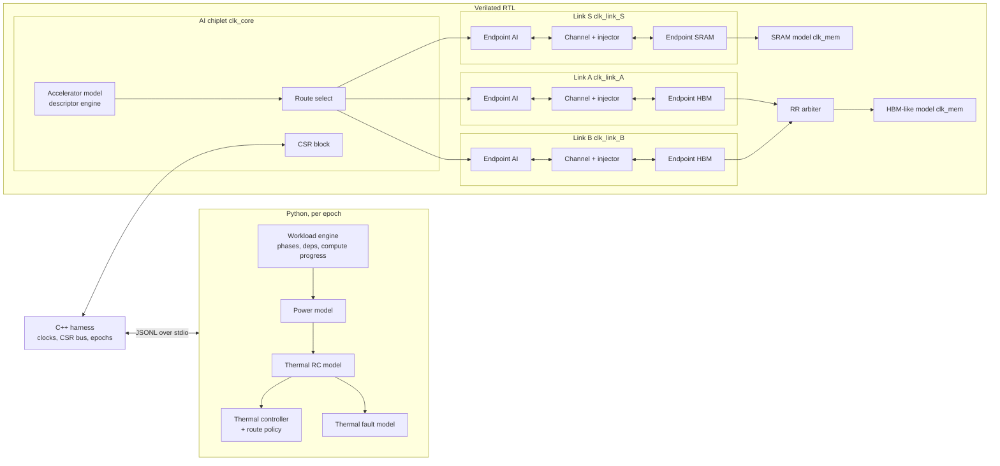

# T-FLEX Architecture Specification

**Status:** Phase 1 draft for review. Nothing in this document is a measured result.
**Disclaimer:** *This project is a UCIe-inspired architectural/RTL research model and is not a certified implementation of the UCIe specification.*

Related documents: [protocol.md](protocol.md) (flit format, retry, training, repair) · [thermal_model.md](thermal_model.md) (power, thermal, fault models) · [cosim_interface.md](cosim_interface.md) (RTL ↔ Python) · [verification.md](verification.md) · [experiments.md](experiments.md) · [limitations.md](limitations.md) · [plan.md](plan.md) (milestones, risks, setup).

---

## 1. What is modeled, in one paragraph

An AI accelerator chiplet talks to an SRAM chiplet over one die-to-die (D2D) link (**S**) and to an HBM-like memory chiplet over two parallel D2D links (**A**, **B**). Every link is full duplex; each direction has its own adapter (link layer: packetization, CRC, go-back-N retry, credit flow control) and PHY (logical abstraction: gearbox, lane mapping, lane repair with spares, training, deskew). A channel model between the two PHYs provides latency, per-lane skew and fault injection. The same RTL is used for 2.5D and 3D; the topologies differ in link parameters (latency, energy/bit, fault scaling) and, much more importantly, in the Python thermal model. The RTL exports per-epoch activity; Python turns it into power, temperature and control decisions (frequency, lane width, injection rate, routing, faults) that are written back into the RTL.

## 2. Block diagram



ASCII fallback (one direction of one link, AI → HBM write):

```
 clk_core                         | clk_link_A                                                                   | clk_mem
 accel -> route -> packetizer -> [async FIFO] -> retry_tx -> gearbox_tx -> lane_map_tx -> injector -> channel ->   |
                                  |           (seq, CRC,    (width      (36 phys     (faults)    (latency,       |
                                  |            replay buf,   32/24/16/8)  lanes)                  skew)           |
                                  |            credits)                                                           |
                                  |  deskew -> lane_map_rx -> gearbox_rx -> retry_rx -> [async FIFO] -> depacketizer -> HBM model
                                  |                                        (CRC chk,
                                  |                                         ACK/NAK)
            sideband (ACK/NAK, credits, training) runs in parallel on its own fixed-latency channel
```

## 3. Clock domains and CDC boundaries

| Domain | Default | Contents | Changed at runtime? |
|---|---|---|---|
| `clk_core` | 1000 MHz | accelerator model, route select, CSR block | no |
| `clk_link_S/A/B` | 2000 MHz each | adapters, PHYs, LTSM, channel, sideband of that link | yes, per link (500–2000 MHz levels), always through a retrain |
| `clk_mem` | 800 MHz | SRAM and HBM-like models, memory-side packetizers | no |

Each link has its own clock so the controller can slow one link without touching the others. Both ends of a link share that link's clock: this abstracts a forwarded clock and keeps the CDC problem at the chiplet-core boundary, where it is real in hardware too.

CDC crossings (all implemented with `tflex_async_fifo`, Gray-coded pointers, 2-FF synchronizers):

1. core → link: TX flit FIFO on the AI side (per link)
2. link → core: RX flit FIFO on the AI side (per link)
3. mem → link: TX flit FIFO on the memory side (per link)
4. link → mem: RX flit FIFO on the memory side (per link)
5. CSR (core) → link: control registers via `tflex_cdc_handshake` (req/ack, multi-bit payload held stable)
6. link → CSR (core): stats snapshot via the same handshake (snapshot request in, "snapshot valid" out)

Credit return is derived from the RX async FIFO's synchronized read pointer, so credits are released exactly when the consumer frees space, without another crossing.

## 4. RTL module catalogue

Conventions: all modules are SystemVerilog, parameterized, synthesizable unless marked **[sim]**. Streams use `*_valid / *_ready / *_data` (a transfer happens when both are high; `valid` must not depend combinationally on `ready`; data must hold while `valid && !ready`). Active-low async reset `rst_n`, synchronized per domain by `tflex_reset_sync`. Names are prefixed `tflex_`.

### 4.1 `rtl/common`

| Module | Purpose | Key parameters | Interface summary |
|---|---|---|---|
| `tflex_pkg` | Types, enums, defaults (exists, Phase 1) | — | — |
| `tflex_reset_sync` | Async assert / sync deassert reset per domain | `STAGES=2` | `clk, arst_n → rst_n` |
| `tflex_sync_2ff` | Bit synchronizer; optional **[sim]** random extra-cycle delay (`SIM_METASTABILITY`) to emulate settling uncertainty | `WIDTH, STAGES` | `clk, d → q` |
| `tflex_sync_fifo` | Single-clock FIFO | `WIDTH, DEPTH` | `in_valid/ready/data, out_valid/ready/data, count` |
| `tflex_async_fifo` | Dual-clock FIFO (Cummings-style Gray pointers) | `WIDTH, DEPTH (pow2), SYNC_STAGES` | `wclk, wrst_n, w_valid/ready/data; rclk, rrst_n, r_valid/ready/data; w_count, r_count; r_ptr_gray_sync_w (for credits)` |
| `tflex_cdc_handshake` | Multi-bit quasi-static transfer with req/ack | `WIDTH` | `sclk, s_valid, s_data, s_busy; dclk, d_pulse, d_data` |
| `tflex_skid_buffer` | Registered valid/ready stage (breaks ready timing path) | `WIDTH` | stream in/out |
| `tflex_crc` | Parallel CRC, XOR matrix generated at elaboration from `POLY` | `DATA_W, CRC_W, POLY, INIT` | `data → crc` (combinational) |
| `tflex_lfsr` | Parallel Galois/Fibonacci LFSR, N steps per cycle | `WIDTH, TAPS, STEP` | `clk, load, seed, advance → state, out` |
| `tflex_rr_arbiter` | Round-robin arbiter with optional priority classes | `N` | `req[N], grant[N], grant_idx` |
| `tflex_rate_limiter` | Token bucket, gates a stream | `RATE_W, BURST_W` | `rate, burst; in → out stream` |

### 4.2 `rtl/adapter` (link layer, `clk_link_*`, except the packetizers)

| Module | Purpose | Interface summary |
|---|---|---|
| `tflex_packetizer` | Header + payload stream → sequence of flit bodies (`ftype`, 224-b body). Payload words are generated from `LFSR(addr, tag)` in the model endpoints, so no bulk data storage is needed. Runs in the source domain (core or mem). | `hdr_valid/ready/hdr (pkt_hdr_t)`, `pay_valid/ready/pay[223:0]/pay_last` → `fb_valid/ready/{ftype, body}` |
| `tflex_depacketizer` | Flit bodies → header + payload stream; checks framing (HEAD before DATA, TAIL terminates, length consistent) | inverse of the above, plus `framing_err` pulse |
| `tflex_retry_tx` | Assigns `seq`, computes CRC, holds unACKed flits in the replay buffer (`RETRY_DEPTH`), go-back-N replay on NAK, per-flit replay counter vs `MAX_RETRY`, TX credit counter | `fb_in` stream; `flit_out` stream (to gearbox); `sb_rx` (ACK/NAK/CREDIT); `retrain_req, retrain_reason`; `quiesce_req/quiesce_done`; stats |
| `tflex_retry_rx` | CRC check, sequence check, duplicate drop, ACK coalescing, NAK generation, in-order delivery | `flit_in` stream (from gearbox, no backpressure: guaranteed by credits); `fb_out` stream (to RX async FIFO); `sb_tx` (ACK/NAK requests); stats |
| `tflex_credit_return` | Converts RX FIFO pops (via synchronized read pointer) into `SB_CREDIT` messages, coalesced | `rptr_gray_sync, wptr → sb_tx credit requests` |
| `tflex_sb_mux` | Arbitrates adapter / LTSM sideband messages onto the sideband channel (training > NAK > ACK > credit) | N message request ports → one `sb_msg_t` stream |

### 4.3 `rtl/phy` (logical PHY, `clk_link_*`)

| Module | Purpose | Interface summary |
|---|---|---|
| `tflex_gearbox_tx` | 256-b flits → beats of `W × LANE_BITS` bits on the active logical lanes. 64-byte circular accumulator; for W = 24 inserts `FT_IDLE` pad flits when the input drains mid-alignment (protocol.md §5). | `flit_in` stream; `width_mode`; → `beat_valid, beat_data[DATA_LANES*LANE_BITS]` |
| `tflex_gearbox_rx` | Beats → flits; flit framing by byte count from the training alignment point; drops `FT_IDLE` flits | `beat_valid, beat_data, width_mode, align` → `flit_out` |
| `tflex_lane_map_tx` | Logical → physical lanes with a per-physical-lane mux; unused physical lanes drive the PRBS idle pattern | `map_table, active_mask` → `phys_data[PHYS_LANES*LANE_BITS]` |
| `tflex_lane_map_rx` | Physical → logical, per-logical-lane mux | `phys_data, map_table` → `log_data` |
| `tflex_lane_repair_ctrl` | Pass mask (from LANE_CHECK) + strike history → map table, width mode, spares remaining; flags permanent vs transient lanes | `rx_pass_mask, prev_bad, strikes` → `map_table, width_mode, spares_left, link_down` |
| `tflex_ltsm` | Link training state machine (RESET … ACTIVE, ERROR, RETRAIN, LINK_DOWN), timers, sideband handshakes, retrain reasons | `sb` in/out, `retrain_req`, `width_req`, `quiesce`, phase controls to PRBS/deskew/repair blocks → `state`, `link_up` |
| `tflex_prbs_gen` / `tflex_prbs_chk` | Per-lane PRBS15, parallel 8 bits/cycle, per-lane seed; self-synchronizing checker with error counter | `enable, lane_idx` → pattern / `rx_data` → `err_cnt[lane]` |
| `tflex_deskew` | Per-lane alignment-marker detection and programmable delay (0 … `MAX_SKEW`) | `phys_data_in, train_align` → `phys_data_out, deskew_done` |
| `tflex_phy_tx` / `tflex_phy_rx` | Wrappers: gearbox + mapper + PRBS/deskew muxing controlled by the LTSM | — |

### 4.4 `rtl/link`

| Module | Purpose |
|---|---|
| `tflex_d2d_endpoint` | One side of one link: TX async FIFO, adapter TX/RX, PHY TX/RX, LTSM, repair controller, sideband mux, stats block. Instantiated twice per link. |
| `tflex_d2d_channel` **[sim]** | Physical medium abstraction, one direction: per-lane pipeline delay (`LATENCY` + per-lane skew), hosts the fault injector. Synthesizable shift registers but not meant to be synthesized as part of a die. |
| `tflex_sideband_channel` **[sim]** | Reliable fixed-latency message pipe, both directions. |
| `tflex_d2d_link` | Endpoint ↔ channel ↔ endpoint, both directions, plus sideband. Parameterized by `LATENCY`, skew list, lane counts. |

### 4.5 `rtl/fault`

| Module | Purpose |
|---|---|
| `tflex_fault_injector` | Applies `fault_cmd_t` commands (bit flip, burst, stuck-at-0/1, dead lane, packet corruption, CRC corruption, temporary link-down, random BER) to the channel's lane data, with an internal free-running cycle counter and LFSRs. Up to `N_CMDS` concurrent commands. |
| `tflex_fault_scheduler` **[sim]** | Queue of timestamped commands loaded through CSR. |

### 4.6 `rtl/routing`

| Module | Purpose |
|---|---|
| `tflex_route_select` | Per-packet path choice for HBM-bound traffic: `static(A|B)` or weighted split (`weight_A` 8-b fraction compared to an LFSR). Switches only at packet boundaries. Policy logic (threshold / cost function) lives in Python and programs these registers each epoch. Responses return on the request's path (header `path` field). |
| `tflex_path_merge` | Memory side: merges links A and B toward the HBM model (round-robin, priority-aware). |

### 4.7 `rtl/thermal`

| Module | Purpose |
|---|---|
| `tflex_thermal_actuator` | Holds commanded width mode, injection level and emergency-throttle bit per link; issues width-change retrain requests to the LTSM; applies `tflex_rate_limiter` to injection. |
| `tflex_hw_trip` | Hardware backstop: compares the per-link sensor register (written each epoch from the Python thermal model, 8.8 fixed-point °C) with `hw_trip_c` and gates injection immediately, independent of the software policy. |

### 4.8 `rtl/top`

| Module | Purpose |
|---|---|
| `tflex_accel_model` | Descriptor-driven traffic engine (DMA-like). Descriptors (`src, dst, op, len, tclass, prio, addr, tag`) arrive from the harness; the engine emits WR_REQ/RD_REQ packets, tracks up to `MAX_OUTSTANDING` reads, checks RD_RESP payload signatures, and reports completions (tag, latency). No compute datapath: compute is modeled in Python (§7). |
| `tflex_mem_sram_model` | Fixed-latency SRAM chiplet model: checks WR payload signatures, returns WR_ACK; serves RD_REQ with `LFSR(addr, tag)` payload after `read_latency`. Synthesizable. |
| `tflex_mem_hbm_model` **[sim]** | HBM-like model: banks, bank-busy time, service-rate token bucket, configurable latency. Not an HBM protocol model. |
| `tflex_csr` | 32-b APB-lite register file in `clk_core`; control fan-out and stats snapshot collection through the CDC handshakes. Register map in cosim_interface.md §4. |
| `tflex_chiplet_ai`, `tflex_chiplet_mem` | Structural wrappers per die. |
| `tflex_system_top` | AI + SRAM + HBM chiplets, links S/A/B, CSR. Parameter `TOPO` only selects defaults; everything is overridable. |

## 5. Lane mapping architecture

Physical lanes per direction: `P = L + S = 32 + 4 = 36`, plus one dedicated valid/framing lane assumed fault-free (limitations.md).

**Mapping rule (compaction):** given the bad-lane mask `bad[P-1:0]` and active width `W`, logical lane `l` maps to the `l`-th good physical lane: `map[l] = index of the (l+1)-th zero in bad`. Consequences, all checked by assertions:

- `map` is strictly increasing over active logical lanes, so no physical lane is assigned twice;
- `map[l] ≥ l` and `map[l] − l` = number of bad lanes below `map[l]` (a "shift");
- spares remaining at full width `= P − 32 − popcount(bad)`.

**Datapath:** TX is a mux per physical lane (physical `p` selects logical `j ∈ [p − MAX_SHIFT, p]`); RX is a mux per logical lane (logical `l` selects physical `p ∈ [l, l + MAX_SHIFT]`). `MAX_SHIFT` is the area/capability knob:

| `MAX_SHIFT` | Mux size | Supports |
|---|---|---|
| `S` (= 4) | 5:1 per lane | up to 4 failures at full width only; 5th failure → link down |
| `P − W_min` (= 28) | up to 29:1 | any failure pattern, degrading to 24/16/8 lanes while ≥ W good lanes remain |

Both variants will be synthesized (area/timing comparison is a planned hardware result). A table-driven 36:1 crossbar (`repair_style: crossbar`) is kept as a third option for non-monotonic policies (e.g. steering around hot lanes); it is optional.

**When the map changes:** only in LTSM state `REPAIR`, with TX quiesced and both ends committing via `SB_MAP_COMMIT`. An assertion requires `map` stable whenever `state == ACTIVE`.

**Width modes vs failures:** after LANE_CHECK the repair controller picks the largest `W ∈ {32, 24, 16, 8}` with `W ≤ min(requested_width, good_lanes)` (the thermal controller may request a narrower width). Fewer than `min_width` good lanes → `LINK_DOWN`.

## 6. 2.5D and 3D mapping onto the same RTL

| Aspect | 2.5D (`configs/2p5d.yaml`) | 3D (`configs/3d.yaml`) |
|---|---|---|
| Dies | AI, SRAM, HBM-like side by side on a Si interposer | AI (top) / memory die with SRAM + HBM regions (middle) / base I/O die (bottom) |
| Links | S, A, B over the interposer | S, A, B as vertical TSV/hybrid-bond-inspired logical links |
| Link RTL parameters | `latency_cycles` 8–12 (assumed) | 2–4 (assumed) |
| Energy/bit | 0.5–0.6 pJ/b (placeholder) | 0.15–0.2 pJ/b (placeholder) |
| Fault scaling | 1× | `vertical_link_fault_scale` what-if knob |
| Thermal | shared lid, lateral separation, secondary path via interposer | stacked; heat from memory and base dies must pass through the AI die (or the weak secondary path) |
| Base die | none (passive interposer) | thermal/power node only; no RTL function |

The RTL difference between topologies is deliberately small: link latency and parameters. This isolates the thermal question (RQ1) from implementation differences.

## 7. Workload and compute coupling

The accelerator model moves data but does not compute. Compute power, which dominates the AI die's thermal budget (see the back-of-envelope in thermal_model.md §1), is produced by the Python workload engine using a roofline-style coupling:

- a workload is a DAG of **phases** (e.g. "load weight tile k", "compute tile k", "write partial sums"); each phase has bytes to move and operations to execute;
- descriptors are released to the RTL when their dependencies are met and the outstanding window allows;
- per epoch, compute progress = `min(peak_ops × epoch_time, ops enabled by bytes delivered so far)`; AI compute power ∝ achieved utilization.

So when the link is throttled, data arrives later, compute stalls and compute power falls. Without this coupling, link throttling would only remove link power (a few % of die power) and every throttling result would be an artifact of the model. Throughput for RQ2 is therefore reported as **workload completion time** in addition to link bandwidth.

## 8. Latency budget of one direction (design targets, to be measured in Milestone 1–4)

| Stage | Cycles (clock) |
|---|---|
| packetizer | 1 (core/mem) |
| async FIFO | 2–3 destination cycles (synchronizers) + 1 |
| retry_tx (seq + CRC + register) | 2 (link) |
| gearbox_tx + lane map | 2 (link), +1 beat per extra flit fraction at W < 32 |
| channel | `latency_cycles` + skew (link) |
| deskew + lane map rx + gearbox_rx | 2 + max_skew (link) |
| retry_rx (CRC check) | 2 (link) |
| async FIFO + depacketizer | 3–4 (dest) |

Retry buffer sizing rule: `RETRY_DEPTH ≥ ⌈RTT_ack × flits_per_cycle⌉` where `RTT_ack` ≈ forward pipeline + ACK coalescing interval + sideband latency. With defaults (≈ 30–40 link cycles at 1 flit/cycle) `RETRY_DEPTH = 64` should avoid retry-buffer stalls; experiment X1 sweeps this.

## 9. Control and observability

- Control (width request, injection level, route registers, emergency throttle, sensor temperatures, fault commands, retrain requests) is written by the harness over the APB-lite CSR bus in `clk_core` and crosses into link domains with `tflex_cdc_handshake`.
- Observability: every endpoint keeps 32-b saturating counters (protocol.md §8 and cosim_interface.md §3 list them). At each epoch boundary the harness requests a snapshot; counters are copied into shadow registers atomically per domain and read over CSR, so one epoch's numbers are mutually consistent.
- Link frequency is set by the harness's clock generator (the RTL cannot change its own clock period); the RTL side sees it as a retrain with reason `RR_FREQ_CHG` and a frequency-level register for statistics.

## 10. Simulation methodology (summary; details in cosim_interface.md and verification.md)

| Layer | Tool | Used for |
|---|---|---|
| Python golden models | pytest | CRC, packetizer, lane mapping, gearbox, thermal model vs analytic solutions |
| Module tests | Verilator `--binary --timing` SV testbenches and cocotb 1.9 + Verilator | directed + constrained-random, scoreboards against the golden models, SVA bound per module |
| System tests | Verilator + C++ harness | end-to-end traffic, faults, retrain, multi-clock |
| Closed-loop experiments | C++ harness ↔ Python over JSON lines | power/thermal/controller loop, one exchange per epoch |

Physical time vs RTL time: one epoch = 10 µs of RTL time, which the thermal model treats as `K × 10 µs` of physical time (default `K = 100`, so 1 ms per epoch). This is an explicit modeling assumption (traffic statistics are treated as stationary within an epoch) and experiment X2 checks that conclusions do not change across `K ∈ {25 … 200}`. The thermal state starts from the steady state of the workload's mean power so the slow heatsink time constant (tens of seconds) does not have to be simulated.
