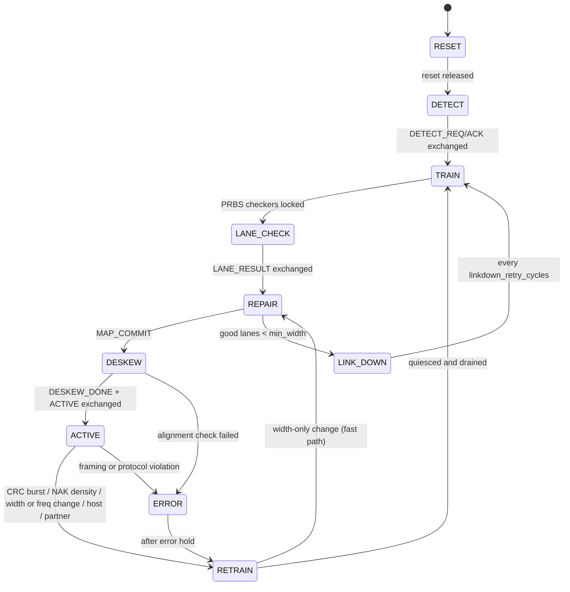

# T-FLEX Protocol Specification (simplified, UCIe-inspired)

**Status:** Phase 1 draft. The executable form of the formats below is `rtl/common/tflex_pkg.sv` (size checks in `tb/directed/tb_pkg_sizes.sv`, passing).
*This project is a UCIe-inspired architectural/RTL research model and is not a certified implementation of the UCIe specification.* Where a concept is borrowed from UCIe (adapter/PHY split, flit-level CRC + retry, sideband, lane repair with redundant lanes, link training, width degradation), the formats, encodings, timers and state names here are our own.

---

## 1. Layering

| Layer | Unit | Responsibility |
|---|---|---|
| Transaction | request / response | read, write, ack between AI and memories (tags, lengths, addresses) |
| Packet | header + payload | framing a transaction into flits |
| Link (adapter) | 256-b flit | sequence numbers, CRC, go-back-N retry, credit flow control |
| Logical PHY | lane beat | gearbox to active width, lane mapping and repair, training, deskew |
| Channel | lane symbol | latency, skew, faults (simulation model of the medium) |

Sideband: a separate, reliable, fixed-latency message channel for training, ACK/NAK and credits.

## 2. Flit format (256 bits)

| Bits | Field | Width | Notes |
|---|---|---|---|
| 255:253 | `ftype` | 3 | `IDLE, HEAD, DATA, TAIL, HEAD_TAIL`, 5–7 reserved |
| 252:245 | `seq` | 8 | sequence number mod 256; ignored for `IDLE` |
| 244 | `flags.replay` | 1 | set on retransmissions (statistics only, covered by CRC) |
| 243:240 | `flags.rsvd` | 4 | zero |
| 239:16 | `body` | 224 | header (HEAD*) or 28 payload bytes (DATA/TAIL) |
| 15:0 | `crc` | 16 | over bits 255:16 |

**CRC:** CRC-16, polynomial `0x1021` (x¹⁶+x¹²+x⁵+1), init `0xFFFF`, not reflected, no final XOR, processed MSB-first over the 240 covered bits. Polynomial, init and width are parameters. Properties relied on: detects all 1- and 2-bit errors in the covered length, all odd-weight errors (the polynomial has an (x+1) factor) and all bursts ≤ 16 bits. Undetected errors are still possible for other patterns (≈ 2⁻¹⁶ for random corruption) and are counted end to end by payload signatures (§8).
Reference vectors (checked in the Phase 1 toolchain smoke test, Verilator vs. Python; they become regression vectors in Milestone 2): 240 zero bits → `0x2A45`; `seq = 0x5A`, everything else zero → `0xB7C3`.

## 3. Packet format

HEAD / HEAD_TAIL body = `pkt_hdr_t` (224 bits):

| Field | Width | Meaning |
|---|---|---|
| `src`, `dst` | 4 + 4 | `AI=0, SRAM=1, HBM=2, BASE=3` |
| `ptype` | 4 | `WR_REQ` (payload), `RD_REQ` (header only), `RD_RESP` (payload), `WR_ACK` (header only) |
| `tclass` | 4 | `GENERIC, WEIGHT, ACTIVATION, KV_CACHE, PARTIAL` |
| `prio` | 2 | 0 = lowest |
| `path` | 2 | `S, A, B` — path used; responses return on the same path |
| `len` | 16 | transfer length in bytes (for RD_REQ: bytes requested) |
| `tag` | 16 | transaction tag, echoed by responses |
| `addr` | 48 | byte address |
| `inject_ts` | 64 | **debug field**: core-cycle injection timestamp for latency measurement; would not exist in hardware |
| reserved | 4 + 56 | zero |

Packet = one HEAD flit followed by `⌈len/28⌉` DATA flits, the last marked TAIL; header-only packets are a single HEAD_TAIL flit. Payload byte `i` is in data flit `⌊i/28⌋`, body byte `i mod 28`; bytes past `len` in the TAIL flit are zero.

Payload content is not stored: every payload byte is `LFSR(addr, tag, i)`; receivers regenerate and compare. This checks end-to-end integrity without GB-scale memory arrays.

**Wire efficiency (analytical, follows from the format):**

| Payload | Flits | Wire bytes | Payload efficiency |
|---|---|---|---|
| 64 B | 1 + 3 = 4 | 128 | 50.0 % |
| 1024 B | 1 + 37 = 38 | 1216 | 84.2 % |
| 4096 B | 1 + 147 = 148 | 4736 | 86.5 % |

At full width and 2 GHz the raw rate is 64 GB/s per direction, so the format caps 4 KiB-packet payload bandwidth at ≈ 55.4 GB/s per direction before retries, pads and training overhead (analytical, not simulated).

## 4. Link layer: retry and flow control

### 4.1 Transmitter (`tflex_retry_tx`)

- Each new non-IDLE flit gets `seq = next_seq++`, a CRC, and a slot in the replay buffer (`RETRY_DEPTH` = 64). Window rule: a new flit may be sent only while `next_seq − oldest_unacked < RETRY_DEPTH` (so at most `RETRY_DEPTH` are outstanding); the 256-value sequence space is larger than 2 × window, so wrap-around is unambiguous.
- **Credits:** one credit = one flit slot in the receiver's RX FIFO. A credit is consumed at the first transmission of a flit, not on replays (the receiver discarded the earlier copy, so the slot is still reserved). Initial credits = `rx_credits` (64, ≤ `rx_fifo_depth`).
- `ACK(s)` (cumulative) frees all buffer entries up to and including `s`.
- `NAK(e)`: go-back-N — rewind the send pointer to `e`, replay `e … next_seq−1` with `flags.replay = 1`, then resume new traffic. A per-sequence replay counter is incremented; if the same `e` is NAKed more than `MAX_RETRY` (3) times the transmitter requests `RETRAIN` with reason `RR_CRC_BURST`.
- Replay timer: if flits are outstanding and no ACK/NAK arrives for `T_REPLAY` cycles, replay from the oldest unACKed flit (should never fire with the reliable sideband; counted as a statistic and asserted zero in fault-free tests).
- Retry state (sequence numbers, buffer) **survives a retrain**: after `ACTIVE` is re-entered the transmitter replays from the oldest unACKed flit, so a repaired link loses no packets.

### 4.2 Receiver (`tflex_retry_rx`)

| Received flit | Action |
|---|---|
| bad CRC (any apparent `ftype`) | drop; if not already waiting, send `NAK(expected)` and enter NAK-pending |
| good CRC, `IDLE` | drop (gearbox pad), not sequenced |
| good CRC, `seq == expected` | deliver, `expected++`, clear NAK-pending, count toward ACK coalescing |
| good CRC, `seq` behind `expected` | duplicate from a replay: drop, count |
| good CRC, `seq` ahead of `expected` | gap: drop, `NAK(expected)` if not pending |

ACKs are coalesced: sent every 8 delivered flits or after 16 idle cycles with un-ACKed deliveries. NAK is resent if still pending after a timeout. A second retrain trigger watches NAK density: `≥ nak_window_limit` NAKs within `nak_window_flits` received flits → `RETRAIN` (catches high BER where no single flit exceeds `MAX_RETRY`).

The receiver never back-pressures the gearbox: the credit protocol guarantees RX FIFO space for every sequenced flit it can accept (asserted).

### 4.3 Credit return

`tflex_credit_return` compares the RX FIFO's synchronized read pointer with the last value reported and sends `SB_CREDIT(n)` (coalesced, up to 255 per message).

## 5. Logical PHY

### 5.1 Striping and gearbox

Byte `k` of a flit is bits `[8k+7 : 8k]`. The transmitter treats flits as a continuous byte stream: stream byte `n` (= flit index × 32 + `k`) goes to beat `⌊n/W⌋`, logical lane `n mod W`, where `W ∈ {32, 24, 16, 8}` is the active width. At `W = 32` each flit is exactly one beat and logical lane 31 carries bits 255:248.

A dedicated valid lane marks beats that carry stream bytes. The transmitter only emits full beats. For `W = 24` (32-byte flits do not divide into 24-byte beats) the gearbox would otherwise strand up to 16 bytes when traffic pauses; it therefore appends `IDLE` flits until the stream is back on a 96-byte boundary (at most 2 pad flits per pause). For `W ∈ {8, 16, 32}` no pads are ever needed. The receiver counts bytes from the alignment point established in DESKEW to delimit flits and drops good-CRC `IDLE` flits.

Bandwidth scales as `W/32` (plus pad overhead at W = 24). Note: UCIe defines width degradation in halving steps; the 24-lane mode is this project's extension and exists because the brief asks for it.

### 5.2 Lane mapping and repair

Defined in architecture.md §5 (compaction mapping, `MAX_SHIFT` datapath knob). Summary of the protocol side:

1. Lanes are only tested and remapped during training (`TRAIN` → `LANE_CHECK` → `REPAIR`). During `ACTIVE` a failing lane shows up as CRC errors; retry absorbs transients and repeated NAKs escalate to `RETRAIN`.
2. The receiver of each direction decides which physical lanes pass and sends the mask with `SB_LANE_RESULT`. Both ends compute the same map from `(pass mask, strike history, requested width)` with the same deterministic function, and the transmitter confirms with `SB_MAP_COMMIT`.
3. **Transient vs permanent:** a lane that fails `LANE_CHECK` gets a strike and is excluded for this training. A lane that later passes with fewer than `transient_strikes` (2) strikes is readmitted; at 2 strikes it is excluded permanently.
4. Width: the largest `W ∈ {32, 24, 16, 8}` with `W ≤ min(requested width, good lanes)`; fewer than `min_width` good lanes → `LINK_DOWN`.
5. Spare lanes not used as data carry the idle PRBS so they stay testable.

### 5.3 PRBS and deskew

- Pattern: PRBS15 (x¹⁵ + x¹⁴ + 1), 8 bits per lane per cycle, per-lane seed derived from the physical lane index (so swapped or shorted lanes are detected). Receivers use self-synchronizing checkers (lock after ≥ 15 received bits) and count mismatches over `lane_check_cycles` (512).
- Deskew: the transmitter sends an alignment marker byte on all active lanes in the same beat every `deskew_marker_period` cycles; each receiver lane records the marker arrival cycle; per-lane delay = latest arrival − own arrival (≤ `max_skew_cycles`). Alignment is verified on the next marker; the flit stream starts on the beat after the final marker.

## 6. Sideband messages

`sb_msg_t` = 4-bit opcode + 40-bit argument; latency `sideband.latency_cycles` (8), one message per cycle per direction, assumed error-free.

| Opcode | Argument | Sent by | Purpose |
|---|---|---|---|
| `DETECT_REQ / DETECT_ACK` | — | LTSM | partner presence |
| `TRAIN_START` | width request, frequency level | LTSM | begin PRBS |
| `LANE_RESULT` | `[35:0]` pass mask | RX side | lane test outcome |
| `MAP_COMMIT` | width mode, bad mask digest | TX side | both ends switch maps |
| `DESKEW_DONE`, `ACTIVE` | — | LTSM | enter ACTIVE together |
| `ACK` / `NAK` | `[7:0]` seq | retry RX | retry protocol |
| `CREDIT` | `[7:0]` count | credit return | flow control |
| `RETRAIN_REQ` | `[3:0]` reason | either end | coordinated retrain |

Priority at `tflex_sb_mux`: training > NAK > ACK > CREDIT.

## 7. Link training state machine

Rules (each becomes an assertion): `ACTIVE` is reachable only from `DESKEW` with `deskew_done`, a committed map and the partner's `ACTIVE`; no flit is accepted from the TX FIFO outside `ACTIVE`; the lane map is constant in `ACTIVE`; `RETRAIN` completes the drain (no beats in flight) before `TRAIN`.

**Retrain triggers and costs:** CRC-driven retrains run the full sequence (lanes must be retested). A width-only change takes the fast path (`RETRAIN → REPAIR → DESKEW`). A frequency change runs the full sequence because the harness changes the link clock during `RETRAIN`. Each retrain's duration is recorded; throttling therefore pays a real, measured bandwidth cost.

**Repair latency** (reported for Experiment 5) = time from the first NAK caused by the fault to re-entry into `ACTIVE`, split into detection (NAK → retrain request), drain, training (TRAIN + LANE_CHECK), repair/deskew. The fault injection time is also logged so detection latency after injection can be reported separately.

## 8. Counters exported per epoch

Per endpoint and direction (32-b saturating, snapshot at epoch boundaries):

- TX: `flits_new, flits_replayed, flits_idle_pad, payload_bytes, beats_valid, stall_no_credit, stall_window_full, replay_events, replay_timeouts`
- RX: `flits_ok, crc_errors, seq_gaps, duplicates, naks_sent, acks_sent, framing_errors`
- LTSM: `state, width_mode, bad_lane_mask, perm_bad_mask, spares_left, retrain_count[reason], cycles_not_active, last_repair_cycles`
- Accelerator: `desc_issued, desc_completed, rd_bytes, wr_bytes, latency_sum, latency_max, latency_hist[8]` (log2 bins), `outstanding`, `sig_errors` (payload signature mismatches = undetected corruption), `route_count[path]`
- Memories: `reads, writes, sig_errors, bank_conflict_stalls`
